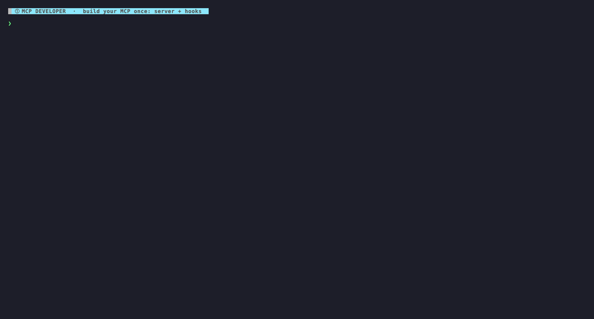

<p align="center">
  
</p>

# agent-connector

### Deploy one MCP to every agent CLI.

Write your server + hooks once with `defineConnector()`, then `install` it into
the native config — or `package` it as a real plugin — across **42 agent CLIs**
(Claude Code, Codex, Cursor, Copilot, Gemini, OpenCode, Warp, Zed…).

[](https://www.npmjs.com/package/@ken-jo/agent-connector)
[](LICENSE)


**Two audiences:** connector developers start at [Quick start](#quick-start);
if you already run an agent CLI and just want token totals, jump straight to
[`usage`](#token-telemetry--usage).

- [Quick start](#quick-start) — depend on the SDK, declare a connector, install it
- [Ship it](#ship-it-direct-install-or-a-marketplace-plugin) — direct install or a marketplace plugin
- [What you define once](#what-you-define-once) — server, hooks, and the other surfaces
- [How it works](#how-it-works) — single home binary, per-project data, hook paradigms
- [CLI](#cli) — every command at a glance
- [Token telemetry & usage](#token-telemetry--usage) — per-tool telemetry vs. connector-free `usage`
- [Publish to the MCP ecosystem](#publish-to-the-mcp-ecosystem) — emit the official MCP standard artifacts
- [Verification](#verification) — how the 42-platform contract is proven

<p align="center">
  <a href="examples/showcase-demo/">
    
  </a>
</p>

<p align="center"><sub>
  Define once → ship it as your own branded CLI → users install via their host's native marketplace → one command drives every CLI.
  <a href="examples/showcase-demo/">Regenerate this demo.</a>
</sub></p>

## Quick start

agent-connector is an **SDK you depend on**, not a global tool. Add it to the
package that holds your connector, declare the connector once, then `install` —
it deploys to every detected agent CLI in that host's own native config. The
linear path is: **get a server → declare it → install**.

**0. You need an MCP server file first.** The config below points at
`./my-mcp-server.mjs`, so that file must exist before you install. Don't have an
MCP server yet? Copy
[`examples/acme-db/acme-db-mcp-server.mjs`](examples/acme-db/acme-db-mcp-server.mjs)
(a self-contained ~35-line stub) as `./my-mcp-server.mjs`, or follow the
[official MCP SDK quickstart](https://modelcontextprotocol.io/quickstart/server).

```bash
# 1. add agent-connector as a DEPENDENCY of your connector package
npm install @ken-jo/agent-connector
```

```js
// 2. agent-connector.config.mjs — declare your server + hooks once
import { fileURLToPath } from "node:url";
import { defineConnector } from "@ken-jo/agent-connector";

const serverPath = fileURLToPath(new URL("./my-mcp-server.mjs", import.meta.url));

export default defineConnector({
  id: "acme-db",
  server: {
    transport: "stdio",
    command: "node",
    args: [serverPath],
  },
  // hooks, telemetry, and more surfaces — see "What you define once" below
});
```

> While developing, `server.command` can be `node` + a local file path (as
> above); once your server is a published package, switch to `npx` + the package
> name (`command: "npx", args: ["-y", "@acme/acme-db-mcp"]`) — the form the
> [site quick-start](https://agent-connector.ai) teaches.

```bash
# 3. deploy across the agent CLIs detected on this machine
npx @ken-jo/agent-connector detect           # which platforms are installed here?
npx @ken-jo/agent-connector install --dry-run # preview every change first
npx @ken-jo/agent-connector install           # write native config in each host
```

> `install` targets only the hosts actually **detected** on this machine (or an
> explicit `--targets` / `connector.targets` list), intersected with the
> 42-adapter registry — there is no "install to all 42 unconditionally" path.
> A global `npm i -g` is **not** required: `npx @ken-jo/agent-connector …` runs
> straight from your project.

## Ship it: direct install or a marketplace plugin

Same one definition, your choice of distribution.

**Direct install** — `agent-connector install` writes each host's native MCP +
hook + content-surface config in place, with no per-platform marketplace
submission or review. This is the Quick start path above.

**Marketplace plugin** — `agent-connector package` turns the connector into a
real plugin/extension bundle (manifest + bundled commands, agents, skills,
hooks, MCP) from one definition. Hooks + MCP keep the telemetry serve-wrapper,
so a marketplace-installed connector still reports per-tool tokens for its stdio
server. `--format all` emits **10 host formats**:

| Format | Hosts |
|---|---|
| `claude-plugin` | Claude Code · Codex · VS Code Copilot · OpenClaw · OMP |
| `codex-plugin` | Codex (`.codex-plugin/` manifest variant) |
| `copilot-plugin` | GitHub Copilot CLI |
| `factory-plugin` | Droid |
| `gemini-extension` | Gemini CLI |
| `qwen-extension` | Qwen Code |
| `agy-plugin` | Antigravity (CLI + IDE) |
| `cursor-plugin` | Cursor |
| `kimi-plugin` | Kimi CLI |
| `npm-plugin` | OpenCode · Kilo CLI · Pi |

Two official **MCP standard artifacts** are opt-in (they need a `publish` block,
so they're excluded from `--format all`) — `mcp-server-json` (an MCP Registry
`server.json`) and `mcpb` (a one-click MCPB bundle); see
[Publish to the MCP ecosystem](#publish-to-the-mcp-ecosystem).

```bash
# emit every host format (mcp-server-json + mcpb are opt-in by name)
agent-connector package --format all --out ./dist-plugin
agent-connector package --format gemini-extension --out ./ext   # or just one

# e.g. Claude Code:  /plugin marketplace add ./dist-plugin/claude-plugin
#                    /plugin install <connector-id>@agent-connector
# e.g. Gemini CLI:   gemini extensions install ./dist-plugin/gemini-extension/<id>
```

> **Embedded-path caveat.** Most host bundles bake in the absolute home-bin
> launcher path of the machine that ran `package`, so they're valid for a
> **local install on that same machine/home**. For shared distribution use
> `npm-plugin` or the MCP standard artifacts, or re-run `package` per machine.

**Let agent-connector drive the host's own install flow** with `install --method
marketplace`:

- **What it does** — stages the bundle, registers a local marketplace where the
  host has one, then runs the host's plugin-install verb (or, for npm-plugin
  hosts, writes a local `file://` entry); headless and idempotent. Other
  marketplace-format hosts print the exact manual commands.
- **Host coverage** — live-verified for Claude Code, Codex, OpenCode, Kilo
  (CLI + ext), and Antigravity (CLI + IDE) on Linux, Windows, and macOS; Droid
  and Qwen Code have the driver shipped but pending a live host; Gemini CLI is
  legacy (sunsetting toward Antigravity — driver kept for existing installs).
- **Safety + reversal** — a guard refuses installing the same connector by BOTH
  methods, `uninstall --method auto` reverses whichever method is installed, and
  `doctor` checks registration drift.

### Ship a branded CLI

A connector developer can ship their **own** bin instead of having users type
`agent-connector`. `createConnectorCli({ name, connector })` (from the
`@ken-jo/agent-connector/cli` export) exposes **every** subcommand under your
brand, fully delegated and **auto-scoped** to your connector — so your users
never install agent-connector globally or type `--connector`. See
[`examples/branded-cli`](examples/branded-cli) for the full, runnable package.

```js
#!/usr/bin/env node
// bin.mjs — every agent-connector subcommand, branded as `acme-db`
import { fileURLToPath } from "node:url";
import { createConnectorCli } from "@ken-jo/agent-connector/cli";

// run() resolves to the exit code and never calls process.exit
process.exitCode = await createConnectorCli({
  name: "acme-db",
  connector: fileURLToPath(
    new URL("./agent-connector.config.mjs", import.meta.url),
  ),
}).run();
```

After a consumer installs **your** package, the `acme-db` bin is on their PATH
and every command is scoped to your connector (`acme-db install` ≈
`agent-connector install --connector ./agent-connector.config.mjs`). Auto-scoping
is pure argument injection over the SAME single home binary; `serve` and `hook`
still route through the one `~/.agent-connector` home binary every host config
points back to. An explicit `--connector` / `--connector-id` always overrides
the injected default.

## What you define once

A single `defineConnector({...})` declares your MCP **server** + lifecycle
**hooks**, and optionally the additional surfaces — **commands**, **skills**,
**subagents**, **memory**, **statusline**, **actions**, plus host-native escape
hatches. agent-connector renders each surface into every detected host's native
format, or *skip-warns* (never silently drops) where a host can't support it.

```ts
import { fileURLToPath } from "node:url";
import { defineConnector } from "@ken-jo/agent-connector";

// Resolve your server to an absolute path — host CLIs spawn it from their own CWD.
const serverPath = fileURLToPath(new URL("./my-mcp-server.mjs", import.meta.url));

export default defineConnector({
  id: "acme-db",
  server: {
    transport: "stdio",
    command: "node",           // or "npx", "python", etc. — whatever starts your server
    args: [serverPath],        // replace with your real server entrypoint
    env: { ACME_DB_DSN: "${env:ACME_DB_DSN}" },
  },
  hooks: {
    PreToolUse: {
      matcher: "acme_write",
      async handler(evt) {
        return evt.toolName === "acme_write"
          ? { decision: "ask", reason: "Confirm write" }
          : { decision: "allow" };
      },
    },
  },
  // telemetry is on by default
});
```

`agent-connector install` turns that into, e.g.:

| Host | What gets written |
|---|---|
| **Claude Code** | `~/.claude.json` → `mcpServers.acme-db` (+ hooks in `~/.claude/settings.json`) |
| **Codex CLI** | `~/.codex/config.toml` → `[mcp_servers.acme-db]` (+ `~/.codex/hooks.json`) |
| **Cursor** | `~/.cursor/mcp.json` → `mcpServers.acme-db` (+ `~/.cursor/hooks.json`) |

…each pointing hooks at a **single stable home binary**, so one update propagates
everywhere.

**Secret env-refs (`${env:VAR}`).** Write `"${env:VAR}"` (or `"${env:VAR:-default}"`) anywhere in `command` / `args` / `env` / `url` / `headers` to reference an environment variable.

<details>
<summary>Native interpolation vs. literal-at-install resolution</summary>

> On hosts with **native** interpolation (Claude Code, Cursor, VS Code Copilot,
> amp, codebuff) the token is written through to the host config and resolved at
> runtime. Every other host has **no** native interpolation, so the value is
> resolved to a **literal at install time**; an unset variable with no default
> resolves to an **empty string**, and `install` emits a `warn` for it on a
> literal-resolving host.

</details>

**Native hooks escape hatch.** The normalized `hooks` API covers the 13 cross-platform events; for host-only events (Claude Code alone ships 30) declare `platforms: { "claude-code": { nativeHooks: { TaskCompleted: { handler } } } }`.

<details>
<summary>Raw-payload semantics and the ~14 passthrough hosts</summary>

> The handler receives the host's **raw** payload and whatever it returns is the
> **verbatim** JSON reply (exit 0 only — exit-2 blocking isn't modeled). Hosts
> supporting host-native passthrough: `amp`, `claude-code`, `continue`,
> `copilot-cli`, `cursor`, `gemini-cli`, `hermes`, `jetbrains-copilot`, `kimi`,
> `nemoclaw`, `omp`, `openclaw`, `opencode`, `qwen-code`. Others skip-warn.

</details>

**Host-config key patches.** For host-exclusive *settings keys* no other surface reaches, declare `platforms: { "claude-code": { configPatch: [{ key, value, reason }] } }` (Claude Code only for now; other hosts skip-warn with the exact manual edit).

<details>
<summary>Set-if-absent + refcount + denylist semantics</summary>

> Semantics are fixed: **set-if-absent + skip-warn on any conflict** — never
> overwrite, never deep-merge. Ownership is refcounted in a persisted ledger;
> security-relevant keys and keys agent-connector models as first-class surfaces
> are hard-refused.

</details>

### Memory, statusline, actions, and the SDK

- **`memory`** (aligned with the [AGENTS.md](https://agents.md) standard) — ship
  standing guidance that lands in `AGENTS.md` on 33 of the 42 hosts; the two that
  don't read it (Claude Code → `CLAUDE.md`, Gemini CLI → `GEMINI.md`) are wired
  per their own official docs. Writes are surgical marker-fenced, hash-stamped
  managed blocks — multiple connectors coexist, bytes outside your markers are
  never touched, and uninstall excises exactly your blocks.
- **`statusline`** (`defineStatusline`) — a live HUD render function the host
  calls on every status refresh. v1 registers Claude Code's `settings.json.statusLine`
  or Qwen Code's `settings.json.ui.statusLine` (set-if-absent, refcounted,
  reversible); other hosts skip-warn. The runtime is **fail-safe**: any error
  exits 0 with empty stdout so a HUD never wedges the host.
- **`actions`** (`defineAction`) — named, user-invocable operations dispatched by
  the universal verb `agent-connector action <platform> <id> --connector <id>`.
  `install` emits host-side affordances on `droid`, `hermes`, `nemoclaw`, `omp`,
  `openclaw`, and `warp`; other hosts skip-warn. Error semantics are
  user-triggered (unknown id or throw exits 1).
- **The Connector SDK** (`@ken-jo/agent-connector/sdk`, `/sdk/test`) — the
  consolidated authoring surface re-exports `defineConnector`, the full `define*`
  family (`defineHook`, `defineCommand`, `defineSkill`, `defineSubagent`,
  `defineMemory`, `defineStatusline`, `defineAction`, `defineConfigPatch`,
  `defineNativeHook`), introspection helpers (`hostsSupporting`,
  `capabilitiesOf`, `surfaceSupport`), and an **offline harness**
  (`simulate`, `explain`, `explainHooks`) that runs the real adapter
  parse→handler→format chain to answer *"does my handler actually work on host
  X?"* before you touch a real host. See
  [`docs/ARCHITECTURE.md`](docs/ARCHITECTURE.md).

## How it works

- **Home-dir, single binary.** The runtime installs once under
  `~/.agent-connector` (override `AGENT_CONNECTOR_DATA_DIR`). Every host config we
  write is a thin pointer back to that one binary. Updates are
  **explicit/managed** (`agent-connector upgrade`), never silent auto-update.
- **Per-project data, kept.** Telemetry/state is keyed by a stable project
  identity (git remote or normalized path), partitioned per project, stored under
  the home data-root — surviving `git clean`, shared across hosts opening the same
  project.
- **Native config stays native.** We never relocate a host's own settings files;
  only framework-owned state lives under the data-root.
- **Windows-first correctness.** No symlinks, no POSIX-only assumptions.

**Three hook paradigms**, all install-verified across the 42-platform set
(see [`docs/ARCHITECTURE.md`](docs/ARCHITECTURE.md)):

| Paradigm | Platforms |
|---|---|
| `json-stdio` (full hook dispatch) | CodeBuddy · Claude Code · Codex CLI · Cursor · VS Code Copilot · JetBrains Copilot · GitHub Copilot CLI · Gemini CLI · Qwen CLI · Kiro · Kimi CLI · Crush · Goose · Hermes · Droid (Factory) · OpenHands · Antigravity · Antigravity CLI · Continue · Amazon Q · Grok CLI · Devin CLI |
| `mcp-only` (MCP registration only) | Warp · Roo Code · Cline · Trae · Zed · Codebuff · Mux · Pi · Windsurf · Open Interpreter · Junie · Mistral Vibe |
| `ts-plugin` (generated bridge module) | OpenCode · MiMoCode · Kilo CLI · Kilo · OMP · NemoClaw · OpenClaw · Amp |

Adding a platform = **one registry entry + one adapter**.

## CLI

| Command | Purpose |
|---|---|
| `detect` | List installed platforms, scopes, capabilities, hook paradigm. |
| `install [--scope …] [--targets …] [--method …] [--dry-run] [--force]` | Render + write MCP + hooks + content surfaces across targets. |
| `uninstall [--targets …] [--purge] [--method …]` | Full inverse — removes everything we wrote; `--purge` also clears framework state. |
| `upgrade [--channel …]` | Re-render host config + heal stale pointers + refresh the home binary (alias: `update`, `sync`); never a silent self-update. |
| `doctor [--probe] [--explain]` | Per-platform health checks with fixes; `--probe` runs a live MCP handshake, `--explain` prints the per-`(host, event)` hook honor matrix. |
| `status` | Light install-state: which connectors are present on which hosts (always exits 0). |
| `package [--format <fmt>\|all]` | Emit a host plugin bundle, or an OFFICIAL standard artifact: `mcp-server-json` (registry) · `mcpb` (one-click bundle). |
| `action <platform> <id> [--connector <id>]` | Run a declared action from the shell. |
| `telemetry report [--by …] [--since …] [--connector <id>]` | Per-tool token footprint of **your connector's own wrapped server**. Stdio servers only. |
| `telemetry export [--format …] [--connector <id>]` | Raw aggregate records for your wrapped server. |
| `usage report\|export\|leaderboard [--by …]` | **No connector needed.** Host-native whole-conversation token totals parsed read-only from each agent CLI's own logs. Does NOT break down by individual MCP or tool. |
| `leaderboard [--since …] [--connector <id>] [--scope …]` | Three origin-labeled boards with **different prerequisites** (🔌 MCP/plugin · 🛰️ host-native turns · 🖥️ host/user); counts are never summed across them. |

> `hook` and `serve` also exist — internal entrypoints the written host configs
> point at; you never run them by hand. Full flag-level reference: the
> [docs site `/docs/dev/cli`](https://agent-connector.ai/docs/dev/cli) · `llms-full.txt` §3 (canonical, drift-guarded by tests).

## Token telemetry & usage

Two independent, never-summed views of token cost:

- **Per-tool telemetry for *your own* server** (the MCP-developer path). No host
  reports per-tool usage back to an MCP server, so agent-connector measures your
  server's *own* bytes (args in, results out, tool schemas) and tokenizes them
  locally — **aggregate counts only, stored locally, zero egress by default.**
  Per-tool telemetry is automatic for **stdio** servers; remote (`http`/`sse`/`ws`)
  servers are registered but not wrapped (the proxy can't intercept remote
  transports). Read it with `agent-connector telemetry report --by tool`.
- **Connector-free usage** (`agent-connector usage`). Already run Claude Code /
  Codex / Cursor and just want totals? `usage` reads your local agent-CLI session
  logs **read-only** and never writes any host config — no connector, no install:

  ```bash
  npx @ken-jo/agent-connector usage report --by platform        # CLI/model/project/session/day
  npx @ken-jo/agent-connector usage leaderboard --by platform   # or --by model
  npx @ken-jo/agent-connector usage export --format csv --out usage.csv
  ```

  It reports **whole-conversation totals** per agent CLI / model / project /
  session / day. It does **not** itemize cost by individual MCP server or tool —
  agent CLIs don't log per-tool attribution.

**Privacy & tokenizer.** Default tokenizer is `gpt-tokenizer` (pure-JS, no native
build) — `o200k_base` for OpenAI/Codex-family, a documented approximation for
Anthropic; falls back to a `chars/4` heuristic if it can't load. Every record
carries a confidence tag. Raw tool arguments and results are never stored or
transmitted. Off switch: `AGENT_CONNECTOR_TELEMETRY=0`, or
`telemetry: { enabled: false }`.

## Publish to the MCP ecosystem

Where the MCP standard already covers your server's functionality,
agent-connector **emits the standard exactly** so your already-standard work is
portable:

- **`package --format mcp-server-json`** → an official **MCP Registry**
  `server.json` (schema `2025-12-11`). It describes your **real upstream server**
  (what a registry installer runs), not our telemetry wrapper. Publish it with
  the official `mcp-publisher` CLI.
- **`package --format mcpb`** → an official **MCPB** (`.mcpb`, formerly DXT)
  bundle `manifest.json` (`manifest_version 0.3`) for one-click local install in
  Claude Desktop and any MCPB host, with secrets routed through the host keychain
  (`user_config`).

Both read a `publish` block on your connector (the namespace you own + your
published package + author):

```ts
defineConnector({
  id: "acme-db",
  version: "1.2.0",
  server: { transport: "stdio", command: "npx", args: ["-y", "@acme/acme-db-mcp"] },
  publish: {
    registryNamespace: "io.github.acme", // a namespace YOU proved ownership of
    packageName: "@acme/acme-db-mcp",     // your REAL published package
    author: { name: "Acme Inc" },
  },
});
```

> **Config we write is the standard.** `install` writes each host's native MCP
> config in the de-facto canonical `mcpServers` shape — `{ command, args, env }`
> for stdio, `{ url, headers }` for remote. The spec transport slug for
> streamable HTTP is `streamable-http` (registry `server.json`); host configs
> canonically use `http`. WebSocket (`ws`) is **not** an MCP spec transport and
> the standard artifacts reject it.

> **Forward-compatible by transport.** The `serve` proxy is **byte-transparent**:
> it forwards every JSON-RPC message verbatim and only tees a copy to count
> `tools/call` round-trips. So newer MCP features ride through untouched —
> **MCP Apps** (the official `io.modelcontextprotocol/ui` extension) and **any
> reverse-DNS extension** negotiated at `initialize`. A connector whose server
> already speaks these deploys across every host and keeps its telemetry today,
> no agent-connector change required.

## Verification

The full single-API contract is **install-verified across all 42 platforms** by
a committed registry-driven install-roundtrip harness that, for every adapter,
drives the real install → uninstall into an isolated HOME and asserts on-disk
placement + zero residue. A separate committed `scripts/verify-host.mjs` driver
installs **20 real host CLIs** and verifies install → placement →
clean-uninstall, and live hook dispatch + telemetry are proven end-to-end on
several of them. The remaining hosts (IDE extensions / GUI editors with no
headless CLI) stay covered by the install-roundtrip harness.

**Dogfood result:** porting the real multi-host context-mode plugin to
`defineConnector` collapsed **~20,322 lines of hand-maintained per-host code down
to ~76 lines** (a 99.63% reduction). See the reports under
[`docs/research/`](docs/research/) and [`CHANGELOG.md`](CHANGELOG.md).

## Development

```bash
npm install
npm run typecheck
npm run build
npm run dev -- detect     # run the CLI from source via tsx

# Tests: scope + single-fork (NOT bare `npm test` — it OOMs low-RAM machines).
npx vitest run --pool=forks --poolOptions.forks.singleFork=true --poolOptions.forks.maxForks=1 \
  tests/adapters/<host>.test.ts
```

## Contributing

PRs welcome — especially new host adapters and fixes verified against a host's
primary source. See **[CONTRIBUTING.md](CONTRIBUTING.md)** for the dev workflow,
the single-fork test discipline, the **verify-first** rule for adapters, and the
new-host checklist. Want a new agent CLI supported? Open a
[host adapter request](https://github.com/ken-jo/agent-connector/issues/new?template=host_adapter_request.yml).

Security reports: see [SECURITY.md](SECURITY.md).

## License

Apache-2.0 © 2026 KenJo
